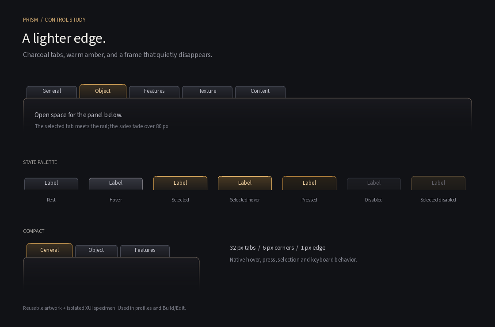

# Prism tabs

Work in progress, uncommitted. Used by avatar profiles, Inventory, Outfits, and
the five Build/Edit property tabs, with their existing panels, callbacks and
localized labels retained.

The existing charcoal and amber palette carries into a 32px tab with 6px upper
corners. Selected tabs rise 4px above their neighbors, with a fine amber highlight
and warmer text. The rounded rail below them fades to transparent over 80px,
including a faint surface wash. It has no bottom border.

## Files and use

- `indra/newview/skins/default/xui/en/panel_prism_tabs.xml` is the reusable wrapper:
  a native tab container with an 80px fading frame and three empty panels.
  Replace those panels when adopting the style. Keep content panel
  backgrounds transparent to retain the fade.
- `floater_prism_tab_preview.xml` in that same directory is an isolated, resizable
  specimen. On the login screen, use **Debug > XUI Preview Tool**, scroll to
  `floater_prism_tab_preview.xml`, select it, and click **Show**. It has no application
  callbacks or saved settings.
- `indra/newview/skins/default/textures/containers/Prism_Tab_*.png` contains seven
  button states plus the frame. Their names and slice regions are registered in
  `textures.xml`, with lazy loading. The artwork is for top-positioned tabs.
- `python scripts/generate_prism_tab_textures.py` regenerates the PNGs and this
  specimen using the repository's existing Pillow dependency.

Tabs use 128×32 source textures with fixed 12px end caps. Keep their displayed
height at 32 and widths at least 60px. The 96×80 frame also has 12px end caps;
the native `tab_top_frame="Prism_Tab_Frame"` attribute draws it at that height,
so the fade does not change when a panel grows. Its top sits behind the tab bottoms.
The frame automatically follows container visibility, including Build's Land mode.
The selected tab covers the rail
under its own body. Put labels in native controls, never into the textures.

`LLTabContainer` accepts an optional `<tab_button>` appearance block containing
existing `LLButton::Params` such as hover, press and disabled images and label
colors. The container retains ownership of tab geometry, labels, callbacks,
font, padding, and the first/middle/last selected/unselected images. Omit the
block to retain existing behavior. Selection, keyboard navigation and overflow
arrows remain provided by the native container.

## Validation

- Release build passed with the repository's canonical command. Executable:
  `E:\BoxxyViewer\build-vc170-64\newview\Release\secondlife-bin.exe`.
- Eight RGBA assets checked for valid slice bounds. The frame's lower row is
  fully transparent and side alpha decreases down the image. Both XUI files
  parse, contain unique control names and registered texture references, and
  have no application settings or callbacks.
- Native login-screen preview checked for tab selection, selected/unselected
  hover, the disabled specimen, and Alt+Left/Right tab navigation. Corrected
  vertical label placement during visual inspection.
- Native edge double-click resizing widened the specimen from 720 to about
  835 UI pixels: the rail followed the width, while its corners and 80px fade
  retained their size. Continuous drag resizing was not verified.
- Avatar profile and Build/Edit integration preserves all existing tab panel XML
  and bindings. Localized overlays inherit the appearance without label changes.
- Inventory's My Inventory/Recent/Worn/Favorites and Outfits' Outfit Gallery/My
  Outfits/Wearing tabs share the same style. Their outer page backgrounds are
  transparent to reveal the frame; list, gallery, filter and action controls are
  retained. XML preservation checks and Release staging/build passed.
- Mouse-down no longer transfers focus to the departing tab; the existing
  mouse-up focus routing and keyboard focus borders remain. Further testing of
  this small focus change was skipped at the user's request.
- Integration Release build and XML preservation/staging checks passed.
  Integrated appearance awaits runtime verification. No login or world actions
  are needed to view the standalone specimen.
